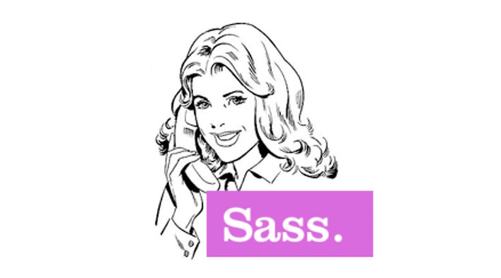

Sass: What it is, how it's used, and why it's so Syntactically Awesome
======================================================================

What is Sass?
=============

.. note::

    Sass--or Syntactically Awesome StyleSheets--is "an extension of 
    CSS that adds power and elegance to the basic language" (Sass docs). 

    It provides us with several handy features that help keep CSS 
    clean and functional.  

    You can think of it as a set of tools which make styling your 
    website easier; kind of like trading a screw-driver for a powerdrill. 

Impudent back talk?
===================

.. rst-class:: build

    No.

.. nextslide::

To sauce or be saucy to?
========================

.. rst-class:: build

    Closer.

.. nextslide::

Stewed Fruit?
=============

.. rst-class:: build

    `What? <http://dictionary.reference.com/browse/sass>`_

But wait, how does it work?
===========================

.. note::

    (Warning: jargon ahead)
    Sass is a scripting language which is interpreted in CSS by 
    a preprocessor. It actually has two syntaxes!  

    The first, Sass (.sass file extension), is an indented syntax 
    similar to haml.  This means that blocks are determined by 
    whitespace.  This syntax is older, and has fallen out of style.

    The second, Sassy CSS (.scss file extension), is an extension of 
    CSS3 syntax.  Any valid CSS statement is also a valid SCSS 
    statement, which makes it more user-friendly.

    :code:`sass-convert` will convert between the two.

Why should I use it?
====================

Is it Turing-Complete?
======================

Ok, so what's the big deal?
---------------------------

.. rst-class:: build

    * Variables

    * Nesting

    * Mixins

    * Inheritance

    * Operators

 
Variables
=========

Boo
---

.. code-block:: css

   .thing{} 

Yay
---

.. code-block:: css

        $primary: #B2D5BA;
        $secondary: #3299BB;
        $font: 'Open Sans', sans-serif;

        h1, h2, h3, h4, p, a{
            font-family: $font;
            color: $secondary;
            }

        article{
            background: $primary;
            }

Nesting
-------

.. rst-class:: build

    .. code-block:: css

            #navigation{
                width: 100%;
                background: $secondary;

                li{
                    display: inline-block;
                    }
                p{
                    font-size: 16px;
                    }
                }

Inheritance
-----------

.. rst-class:: build

    .. code-block:: css

            .block{
                @extend .other-block;
                color: #fff;
             } 

Mixins
------

.. rst-class:: build

    .. code-block:: css

            @mixin border-radius($radius){
                -webkit-border-radius: $radius;
                -moz-border-radius: $radius;
                -o-border-radius: $radius;
                border-radius: $radius;
               }

            .box {@include border-radius(10px);} 

Operators
---------

.. rst-class:: build

    .. code-block:: css
            
            $width: 500px;
            $height: 200px;

            div{
                width: ($width/$height);
                }

Conditional Logic
-----------------

* Data types
* Lists and maps
* !default
* @debug
*

The Future
----------

